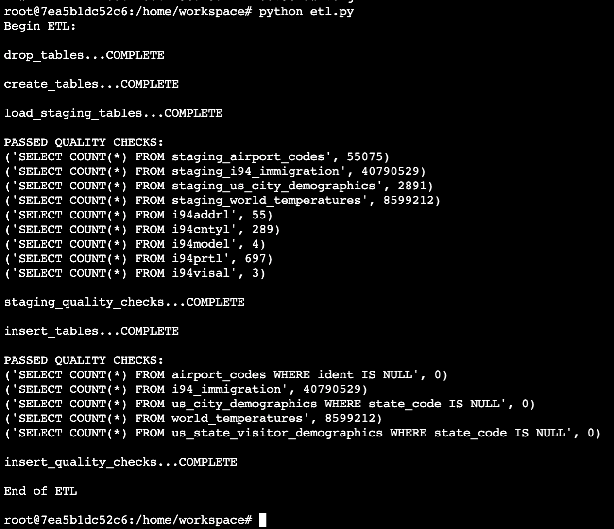
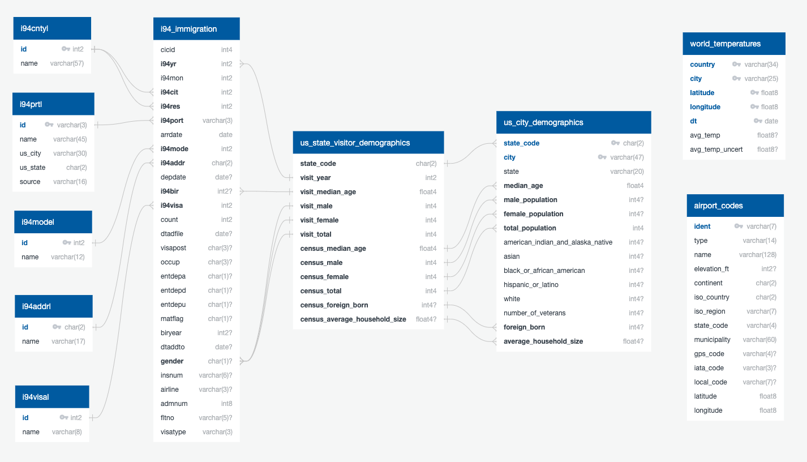

# US Visitor Demographics by State
### Data Engineering Capstone Project

#### Project Summary
The goal of this project was to create an ETL pipeline that joins i94 Immigration data with U.S. Demographics, then enriches the data with historical temperature data and airport codes. This aggregation allows us to see if any of the following impact immigration patterns:

 * Warmer or cooler temperatures.
 * Population demographics of people.
 
The project follows the follow steps:
* Step 1: Scope the Project and Gather Data
* Step 2: Explore and Assess the Data
* Step 3: Define the Data Model
* Step 4: Run ETL to Model the Data
* Step 5: Project Write Up

# Quick start
1. Edit 'dwh.cfg' and add your 'AWS Key', 'AWS Secret', 'S3 Bucket'.
2. Run 'stage_to_s3.py' to upload data to your S3 instance.
3. Run 'IaC.ipynb' to create your RedShift instance.
4. Run 'etl.py' to stage and ingest the data to RedShift.

### Step 1: Scope the Project and Gather Data

#### Scope 
This ETL will extract raw data from S3 into staging tables in RedShift. The data will then be transformed and loaded into the final fact and dimension tables to allow for immigration data analysis.

#### Describe and Gather Data 
* **I94 Immigration Data:** This data comes from the US National Tourism and Trade Office. A data dictionary is included in the workspace. Source: US National Tourism and Trade Office https://travel.trade.gov/research/reports/i94/historical/2016.html See **/raw_data/I94_SAS_Labels_Descriptions.SAS** for a detailed description of the columns.

* **World Temperature Data:** This dataset came from Kaggle.

* **U.S. City Demographic Data:** This data comes from OpenSoft.

* **Airport Code Table:** This is a simple table of airport codes and corresponding cities.

### Step 2: Explore and Assess the Data

#### Cleaning Steps
**Airport Code Table**
1. state_cd - New field derived from 'iso_region'.
2. lattitude - New field derived from 'coordinates'.
3. longitude - New field derived from 'coordinates'.

**I94 Immigration Data**
1. i94cit - Normalize values not found in look up table to '999'.
2. i94res - Normalize values not found in look up table to '999'.
3. i94port - Normalize values not found in look up table to 'XXX'.
4. i94mode - Normalize values not found in look up table to '9'.
5. i94addr - Normalize values not found in look up table to '99'.
6. i94visa - Normalize values not found in look up table to '2'.

**U.S. City Demographic Data:**
1. 'American Indian and Alaska Native' - Derived from 'count'.
2. 'Asian' - Derived from 'count'.
3. 'Black or African-American' - Derived from 'count'.
4. 'Hispanic or Latino' - Derived from 'count'.
5. 'White' - Derived from 'count'.

### Step 3: Define the Data Model
#### 3.1 Conceptual Data Model

#### 3.2 Mapping Out Data Pipelines
1. Upload data to S3.
2. Load data from S3 to RedShift Staging Tables.
3. Copy data from RedShift Staging Tables to Fact and Dimension Tables.

### Step 4: Run Pipelines to Model the Data and perform Data Quality Checks
#### 4.1 Create the data model
See 'sql_queries.py'

#### 4.3 Data dictionary 
See 'data_dictionary.pdf' for details on columns and data-types. The create table queries can be found in 'sql_queries.py' under the 'CREATE TABLE QUERIES' header.

#### Step 5: Complete Project Write Up
**1. Rationale for the choice of tools and technologies for the project.**
* For performance, I went with loading all data to S3, then ingesting into RedShift using the same AWS region.
* Python and Spark were used to locally process and upload to S3.
* RedShift was used to read from S3, clean, and process into the final fact & dimension tables.

**2. How often the data should be updated and why.**
* The data would be processed on a monthly basis to account for new i94 Immigration and weather data.

**3. How to approach the problem differently under the following scenarios:**
* The data was increased by 100x.
    * RedShift would be able to handle this increase with more nodes to better utilize RedShift features of: Massively parallel processing, Columnar data storage, Data compression, Query optimizer, Result caching, Compiled code.
* The data populates a dashboard that must be updated on a daily basis by 7am every day.
    * To avoid daily table truncate and refreshing, we would convert the ETL and model into a slowly changing dimension pipeline and only capture new data or existing data changes (see https://en.wikipedia.org/wiki/Slowly_changing_dimension for details).
* The database needed to be accessed by 100+ people.
    * The data would need to be moved to an in-memory database such as Spark to avoid read/write performance issues that are inherent with traditional databases including RedShift. We would still utilize S3 and RedShift to store the data, but it would be staged to Spark where it would be accessed by users quickly.